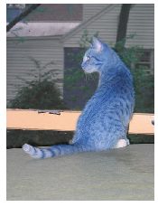
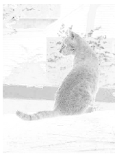
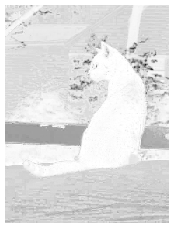
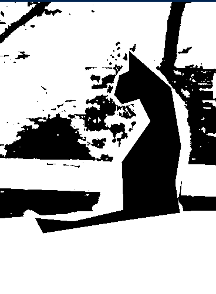
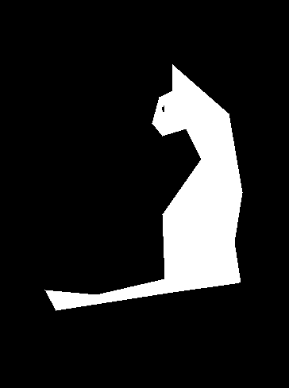
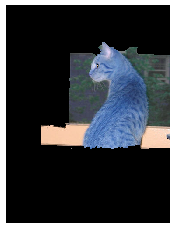

# Graph-Cut-Segmentation
As applied in the field of computer vision, graph cut optimization can be employed to efficiently solve a wide variety of low-level computer vision problems, such as image smoothing, the stereo correspondence problem, image segmentation, object co-segmentation, cv problems that can be formulated in terms of energy minimization. 

## Overview

Let us apply Graph-cuts for foreground/background segmentation. In the “cat” image, you are given a rough polygon of a foreground cat. Apply graph-cut based method to see if we can get a better segmentation!

Firstly, use the provided polygon to obtain an estimate of foreground and background color likelihood. You may choose the likelihood distribution (e.g., color histograms or color mixture of Gaussians.).

Secondly, apply graph-cut code (cv2.grabcut) to do better segmentation. You can use the provided bounding-boxes and use "cv2 package" for the implementation sake. You are required to draw interesting conclusions on how it performs on different samples.

## Usage

```
Run GraphCut.ipynb
```

# Results

<table>
  <tr>
    <td> </td>

    <td></td>
   </tr> 
   <tr>
      <td></td>

      <td>
  </td>
  </tr>
</table>


<!--  <br>
Original Image
<br>
 <br>
Background Probability Map
<br>
 <br>
Foreground Probability Map
<br>
 <br>
Gaussian Mixture Model
<br>
 <br>
Foreground Mask
<br>
 <br>
Result -->


